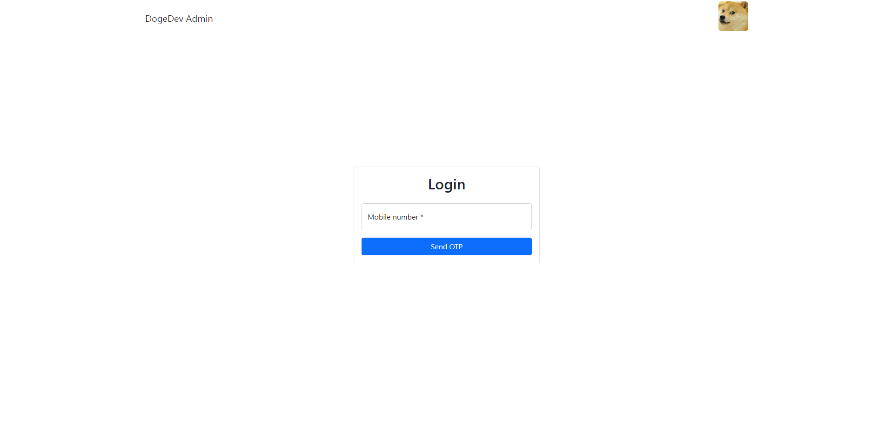
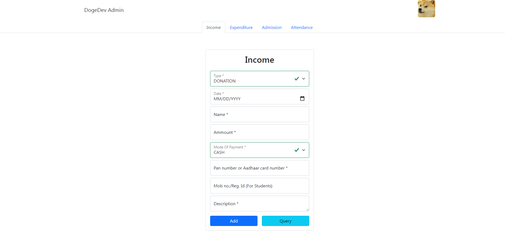
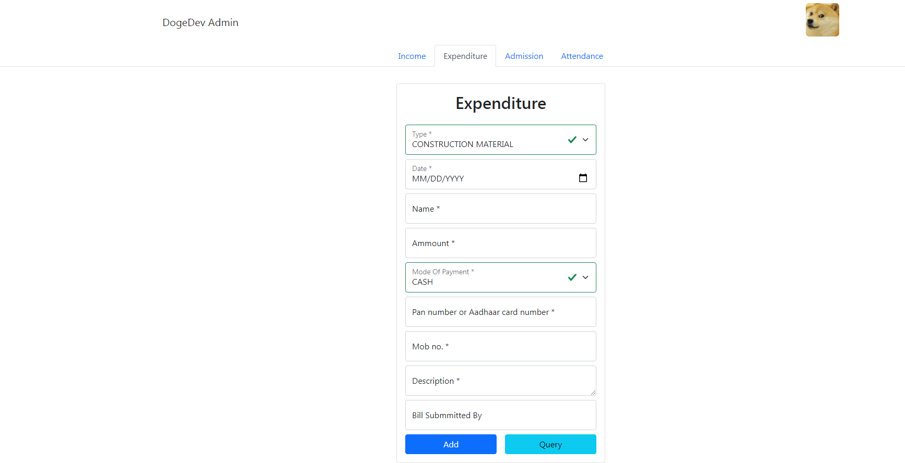
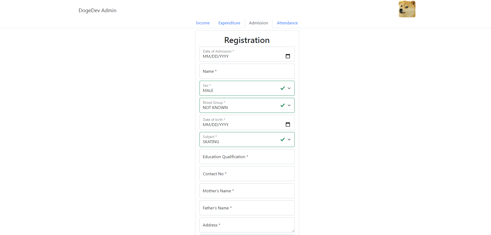
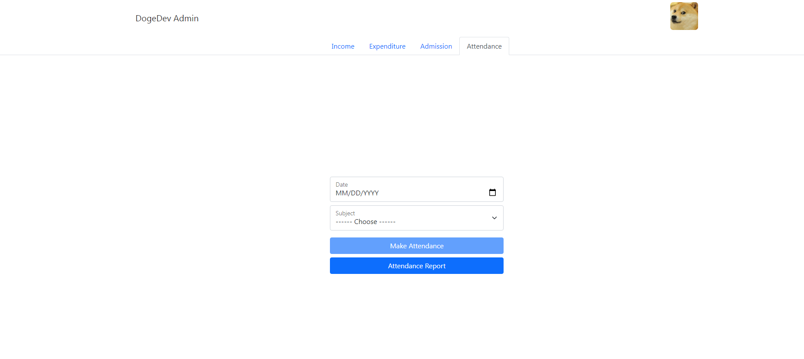

# DogeDev Admin

A Demo Admin App For Small Schools, Tutions, Institutes, etc. Created By KUSHAD CHAKRABORTY

## Features

1. Add Income And Also Print Or Download Receipt
2. Query Income
3. Add Expenditure And Also Print Or Download PayCheck
4. Query Expenditure
5. Student, Teacher And Group-D Staff Admission
6. Print ID Card
7. Add Daily Attendance Of Students, Teachers And Group-D Staff
8. Monthly Attendance Report Of Everyone
9. System Access To Only Authorised Phone Numbers With OTP Verification
10. All Data Like Admission Subjects, Expenditure Types And Income Types Are Fetched From Google Spreadsheet
11. All The Students' , Teachers' And Group-D Staffs' Data Are Stored In Google Spreadsheet
12. Document Attachment with expenditure

## Technical Things

1. React For Frontend
2. React Bootstrap For Styling
3. React Router Dom For Routing
4. Firebase For Storing Student Attendance, For Phone Authentication And For Storing Document Links
5. Google Spreadsheet Dependency For Connecting And Interacting With Google Spreadsheet
6. React Hook Form For Form Validation
7. Firebase Hosting For Deployment
8. Firebase Storage For Storing Documents

## Screen Shots

> Auth Page
> 

> Income Page
> 

> Expenditure Page
> 

> Admission Page
> 

> Attendance Page
> 

# Live Demo

Live Demo Can Be Found At <a href="https://admin-dogedev.web.app/">https://admin-dogedev.web.app/</a>
