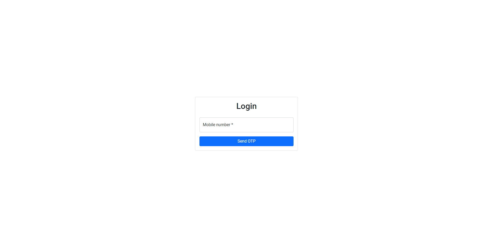
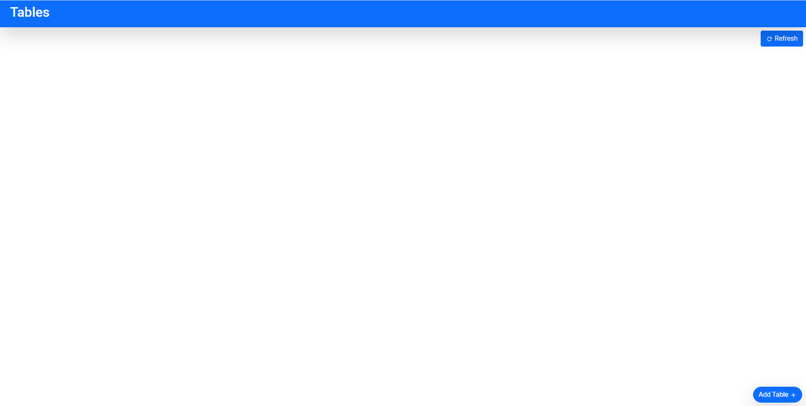
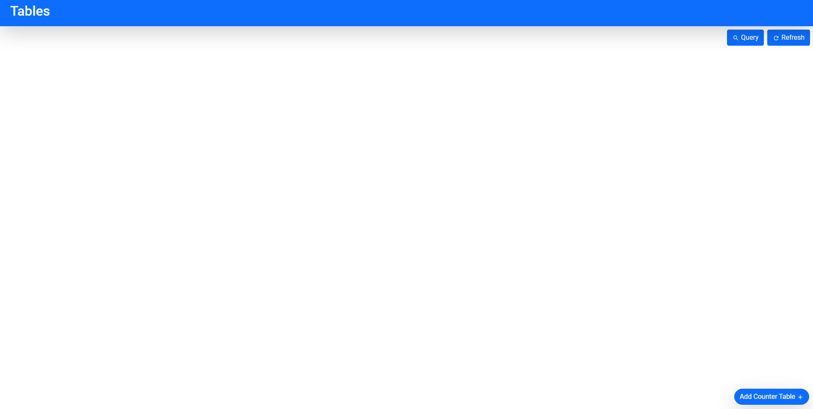
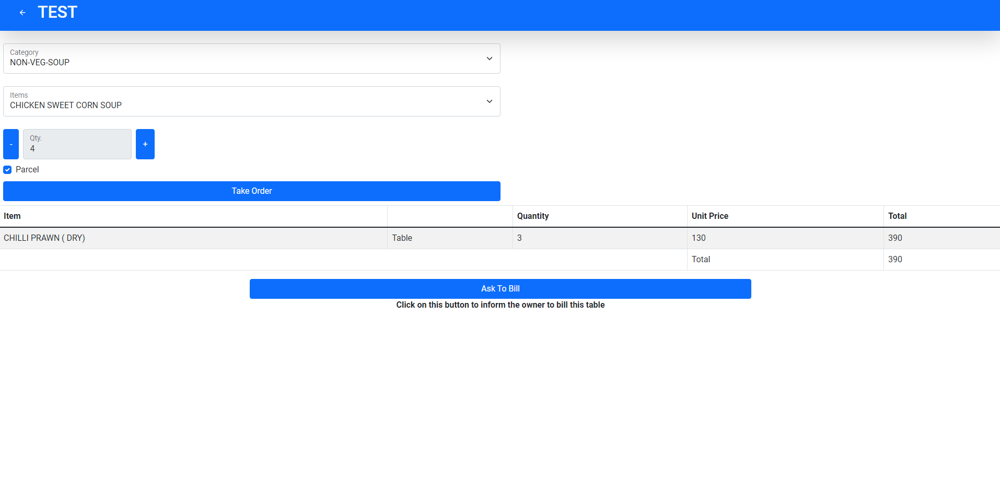
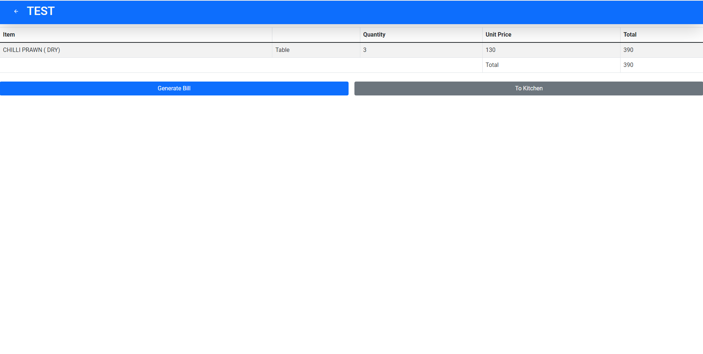
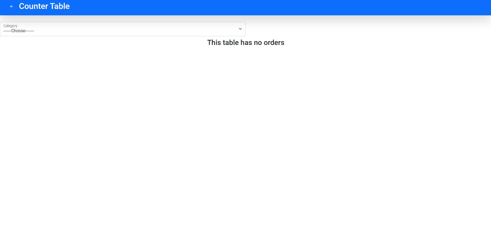

# DogeDev Admin

A Demo Restaurant App Created By DogeDev (KUSHAD CHAKRABORTY)

## Features

1. Add Tables By Waiter
2. Delete Tables
3. Add Counter Table Priviledge For Owner
4. Realtime Data Fetching For Table Details And Order Details
5. Add To Kitchen For 58mm Thermal Printer
6. Generate Bill For 58mm Thermal Printer
7. Query Bills
8. Student, Teacher And Group-D Staff Admission
9. System Access To Only Authorised Phone Numbers With OTP Verification
10. All Data For Menu Is Fetched From Google Spreadsheet
11. All The Order Details Are Kept In Google Spreadsheet

## Technical Things

1. React For Frontend
2. React Bootstrap For Styling
3. React Router Dom For Routing
4. Firebase For Storing Restaurant Tables And Orders And Other Details And For Phone Authentication
5. Google Spreadsheet Dependency For Connecting And Interacting With Google Spreadsheet
6. React Hook Form For Form Validation
7. Firebase Hosting For Deployment

## Screen Shots

> Auth Page
> 

> Tables Page (Waiter)
> 

> Tables Page (Owner)
> 

> Table Page (Waiter)
> 

> Tables Page (Owner)
> 

> Counter Table Page
> 

# Live Demo

Live Demo Can Be Found At <a href="https://restaurant-dogedev.web.app/">https://restaurant-dogedev.web.app/</a>
